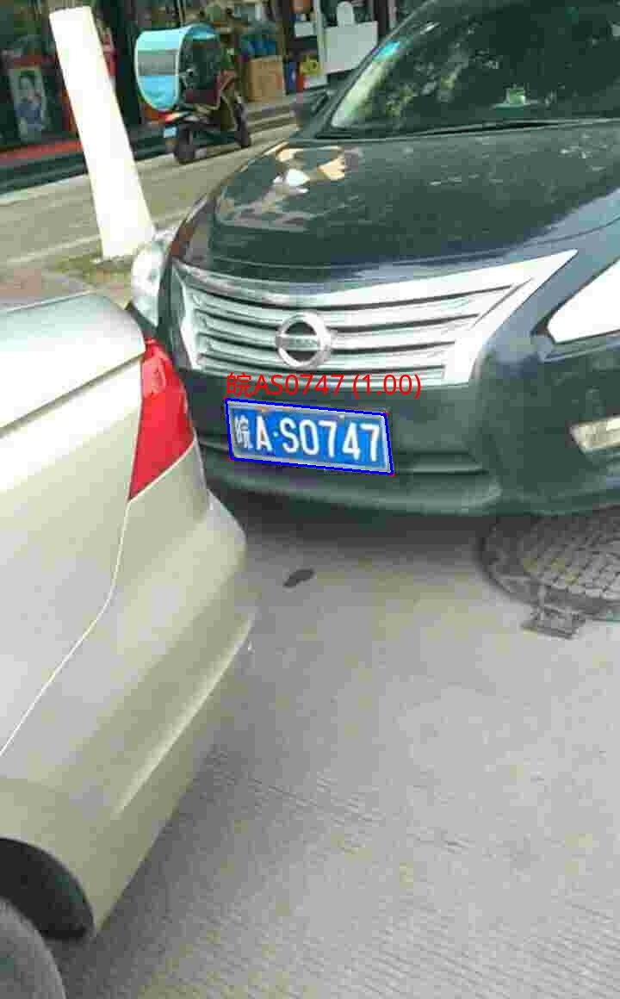
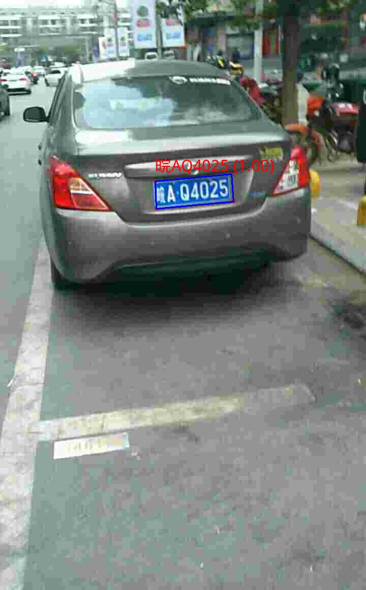

# 地库车辆定位系统 (Garage Vehicle Locator System)

基于 **PyQt5** 和地瓜派 **RDK X5 BPU 硬件加速** 的多路摄像头车牌定位与轨迹检索系统。系统会实时读取地库摄像头画面，检测车牌四角，裁切矫正后识别车牌，并把车辆最近一次出现的位置写入本地 SQLite 数据库，方便通过车牌号快速查询“最后出现位置”。

## 功能概览

- 支持最多 4 路摄像头、视频文件或测试图片输入。
- 使用槽位式共享帧缓冲，采集线程只保留每路最新画面，避免视频积压。
- 使用单独推理线程串行调用 PC 或 BPU 后端，降低 BPU 资源冲突风险。
- 支持 PC 测试后端：YOLO pose + PaddleOCR。
- 支持 RDK X5 板端后端：YOLO pose `.bin` + LPRNet `.bin`。
- 使用 SQLite 保存车牌、摄像头编号、时间和车牌裁切图。
- PyQt5 全屏监控台支持实时日志和车牌末次位置查询。
- 提供 SSH 无界面自检脚本，便于板端联调。

## 效果展示

系统使用 YOLO pose 模型定位车牌四角，再进行透视变换裁切和字符识别。以下是板端测试图的标注效果：

| 样例一：皖A·S0747 | 样例二：皖A·Q4025 |
| :---: | :---: |
|  |  |

## 架构说明

核心并发模型是 **CameraGrabber 多路采集 + FrameBuffer 最新帧槽位 + InferenceWorker 单线程串行推理**。

1. `CameraGrabber` 每路一个线程，从摄像头、视频或图片源读取画面。
2. `FrameBuffer` 按 `camera_id` 保存最新帧，新帧覆盖旧帧，保证实时性。
3. `InferenceWorker` 等待任意通道更新，然后串行取出当前批次帧并调用检测后端。
4. `PCDetectionBackend` 或 `BPUDetectionBackend` 输出统一的 `DetectionResult`。
5. UI 线程更新监控画面，并通过 `DBManager` 记录车牌出现事件。
6. 查询框按车牌号查询 SQLite 中的最后出现位置。

更细的模块职责见 [`docs/REPO_MAP.md`](docs/REPO_MAP.md)。

## 目录结构

```text
garage_locator/
├── assets/                     # 测试图片和 README 展示图片
├── docs/
│   ├── REPO_MAP.md             # 模块地图和数据流
│   └── TESTING.md              # 轻量测试说明
├── models/                     # PC 与板端模型权重
│   ├── yolo11m-pose-carplate.pt
│   ├── yolo11m-pose-carplate_bayese_640x640_nv12.bin
│   └── lpr.bin
├── test/
│   └── test_headless.py        # 板端无界面自检入口
├── utils/                      # 单层方法文件目录
│   ├── camera_worker.py
│   ├── db_manager.py
│   ├── detect_plate_rdk.py
│   ├── gui_theme.py
│   ├── inference.py
│   ├── plate_utils.py
│   ├── preprocess.py
│   ├── postprocess.py
│   └── ultralytics_yolo_pose.py
├── main.py                     # PyQt5 主程序入口
├── requirements.txt
└── .gitignore
```

`utils/` 保持单层目录，避免方法文件分散。各文件职责见 [`utils/README.md`](utils/README.md)。

## 环境准备

基础依赖：

```bash
pip3 install -r requirements.txt
```

PC 端推理还需要安装 `ultralytics`、`paddlepaddle`、`paddleocr`。这些依赖在 `requirements.txt` 中作为可选项注释，按本机环境安装即可。

RDK X5 板端推理需要系统中可导入 `hbm_runtime`，并确保 `models/` 下的 BPU `.bin` 模型存在。

Windows PowerShell 可把下面命令里的 `python3` 换成 `python`。

## 运行方式

### PC 端模拟运行

```bash
python3 main.py \
  --backend pc \
  --inputs assets/test_plate.jpg assets/test_plate2.jpg \
  --yolo-model models/yolo11m-pose-carplate.pt
```

说明：

- `--backend pc` 会初始化 YOLO + PaddleOCR。
- `--inputs` 最多读取 4 路，顺序对应 1 到 4 号摄像头。
- 图片源会通过 OpenCV 读取，适合开发机快速看 UI 和流程。

### RDK X5 无界面自检

```bash
python3 test/test_headless.py \
  --backend bpu \
  --inputs assets/test_plate.jpg \
  --yolo-bin models/yolo11m-pose-carplate_bayese_640x640_nv12.bin \
  --lpr-bin models/lpr.bin
```

脚本会运行约 20 秒，输出检测日志，并生成 `headless_test.db`。该数据库已被 `.gitignore` 忽略。

### RDK X5 全屏监控台

```bash
DISPLAY=:0 python3 main.py \
  --backend bpu \
  --inputs /dev/video0 assets/test_plate.jpg \
  --yolo-bin models/yolo11m-pose-carplate_bayese_640x640_nv12.bin \
  --lpr-bin models/lpr.bin
```

使用方式：

- 查询框输入车牌并回车，右侧面板会显示末次摄像头、时间和车牌裁切图。
- 按 `Esc` 退出全屏程序。
- 未配置输入源的通道显示离线占位图。

### 独立车牌识别 CLI

`utils/detect_plate_rdk.py` 可单独处理图片、目录、视频或摄像头，适合调试模型和裁切参数：

```bash
python3 utils/detect_plate_rdk.py assets/test_plate.jpg \
  --model models/yolo11m-pose-carplate_bayese_640x640_nv12.bin \
  --rec-model models/lpr.bin \
  --no-show
```

## 测试

轻量验证命令：

```bash
python3 -m py_compile main.py utils/*.py test/test_headless.py
python3 main.py --help
python3 test/test_headless.py --help
python3 utils/detect_plate_rdk.py --help
```

更多测试说明见 [`docs/TESTING.md`](docs/TESTING.md)。

## 数据与生成物

- 主程序默认数据库：`vehicle_locator.db`。
- 无界面自检数据库：`headless_test.db`。
- 独立识别 CLI 默认输出目录：`output_results/` 或输入目录下的输出目录。
- 车牌裁切调试目录：`plate_crops/`。

这些运行生成物均不应提交，已在 `.gitignore` 中忽略。

## 开发约定

- 根目录保留 `main.py` 作为主入口。
- 方法文件统一放在单层 `utils/` 下。
- 测试和自检入口放在 `test/` 下。
- 车牌几何裁切、文本清洗、图片读写和绘制工具统一放在 `utils/plate_utils.py`。
- BPU runtime 相关封装保持在 `utils/ultralytics_yolo_pose.py` 和 `utils/detect_plate_rdk.py`。
- 修改目录结构后，至少运行 `docs/TESTING.md` 中的轻量测试。
